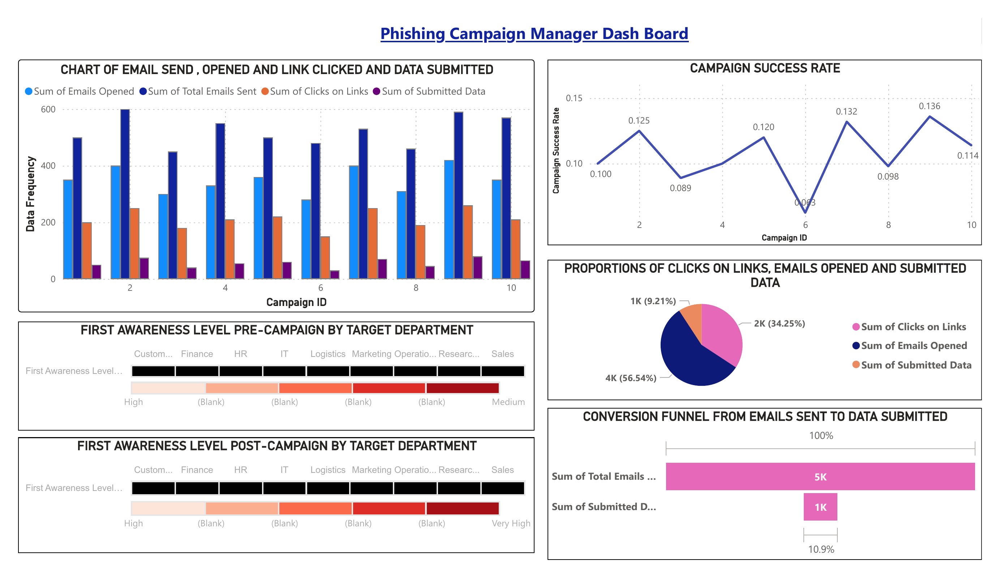
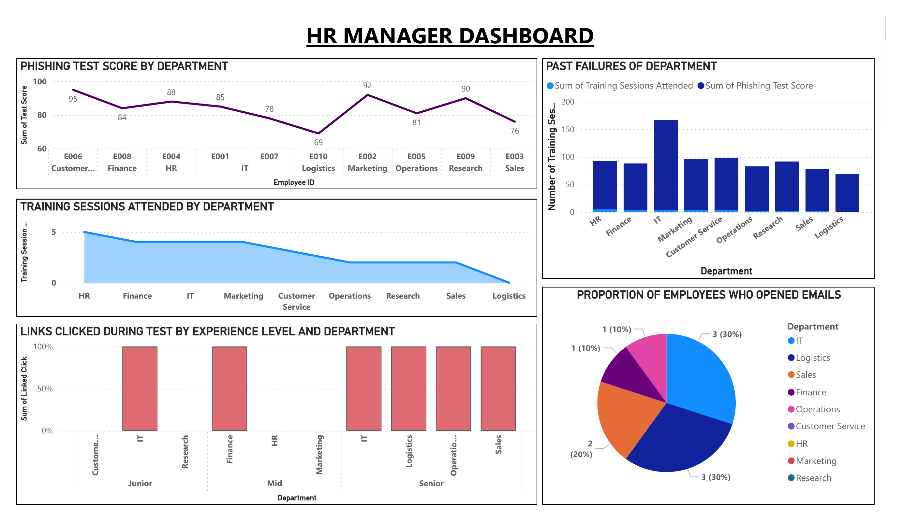
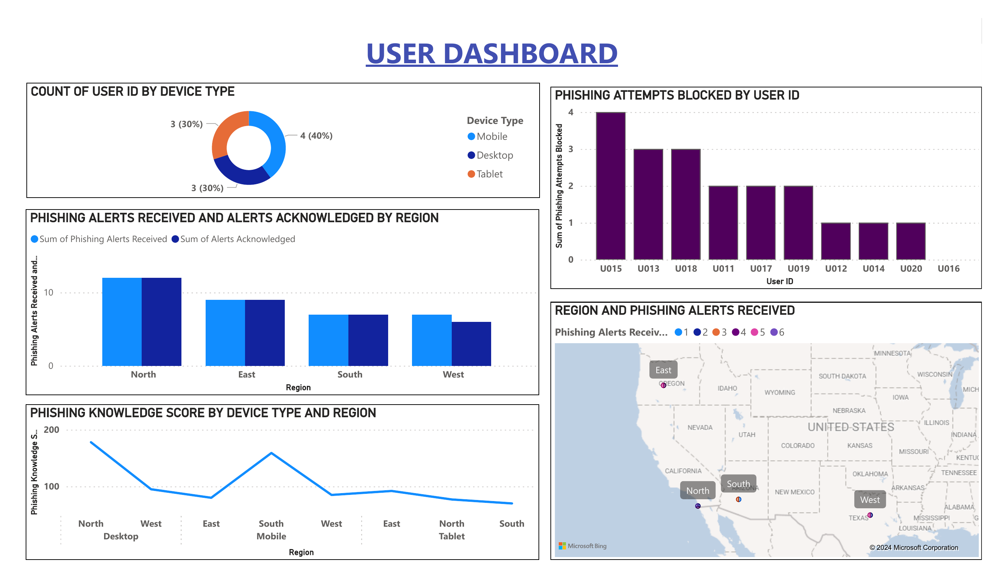

# Phishing Risk & Business Intelligence

Power BI reporting solution analysing simulated phishing campaign performance, employee vulnerability and security awareness, built as three stakeholder-specific dashboards: Campaign Manager, HR Manager, and Individual User.

## Campaign performance

Across 10 simulated campaigns, **56.5% of recipients opened the email, 34.25% clicked the link, and 9.21% went on to submit data** (credentials or other sensitive info): the true measure of phishing risk, since only submitted data represents a real compromise.

  

Campaign success rate (the click-through rate) swung between **8.9% and 13.6% across campaigns**, with no clear improvement trend, suggesting campaign design (not just repetition) drives outcomes more than awareness decay alone. Awareness levels shifted from "High/Medium" pre-campaign to "High/Very High" post-campaign for the target departments shown, indicating the simulated campaigns did move the needle on measured awareness.

## Department-level risk (HR view)

**IT recorded by far the highest training session volume (~165 sessions) yet still posted a mid-table phishing test score (78)**: training volume alone isn't producing proportionate results. Customer Service scored highest on the phishing test (95) despite comparatively little training, while Sales scored lowest (76).

  

Link-click behaviour splits by seniority: junior staff clicks concentrated in IT and Research, mid-level in Finance, and senior staff clicked across four departments (IT, Logistics, Operations, Sales); seniority alone doesn't protect against phishing susceptibility in this data. By department, **IT and Logistics together account for 60% of all opened phishing emails.**

## Individual exposure (User view)

  

- 40% of monitored access is via mobile, 30% desktop, 30% tablet.
- The top 3 users by phishing attempts blocked (U015, U013, U018) blocked 3-4 attempts each, while the bottom users (U012, U014, U016, U020) blocked only 1, a meaningful spread in individual exposure that a department-level view alone would miss.
- Phishing knowledge scores vary sharply by device and region combination, peaking on North Desktop and South Mobile, and dropping to their lowest on South Tablet.

## Recommendations

1. **Don't treat training volume as a proxy for readiness.** IT's high session count with a mid-table test score suggests content/format matters more than frequency, worth auditing what IT's training actually covers.
2. **Target Logistics and IT specifically**, since together they account for the majority of opened phishing emails, rather than running department-uniform campaigns.
3. **Track submitted-data rate, not just click rate**, as the headline risk KPI; a 34% click rate looks alarming until you see only a quarter of clickers went on to submit data.
4. **Follow up individually with low-blocking users** (U012/U014/U016/U020) rather than relying on department-level averages to catch them.

## Tools & techniques

`Power BI` `Data Modelling` `DAX` `KPI Development` `Dashboard Design` `Stakeholder-Specific Reporting` `Risk Analysis`

## Repository contents

- [`Phishing-Campaign-Manager-Dashboard.pdf`](Phishing-Campaign-Manager-Dashboard.pdf), [`HR-Manager-Dashboard.pdf`](HR-Manager-Dashboard.pdf), [`User-Dashboard.pdf`](User-Dashboard.pdf): full-resolution exports of each dashboard
- `images/`: dashboard screenshots referenced above
